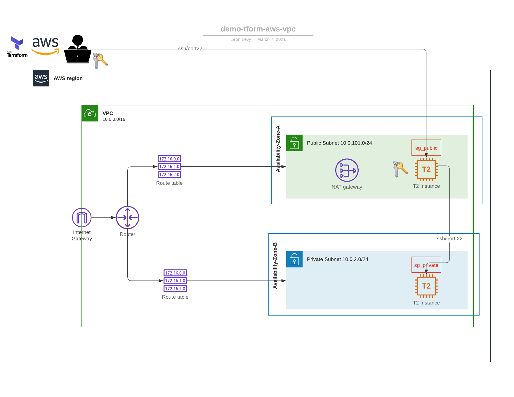

# Openscap Testing env in AWS for AMI's built via Redhat Image Builder 

This project will create a testing environment that runs vunerability scans on an EC2 instance whose AMI was created by Red Hat's Image Building tool 

## High level diagram

## Providers

No provider.

## Inputs

| Name | Description | Type | Default | Required |
|------|-------------|------|---------|:--------:|
| namespace | The project namespace to use for unique resource naming | `string` | `"LL-TEST"` | no |
| region | AWS region | `string` | `"us-east-1"` | no |

## Outputs

| Name | Description |
|------|-------------|
| private\_connection\_string | Copy/Paste/Enter - You are in the private ec2 instance |
| public\_connection\_string | Copy/Paste/Enter - You are in the matrix |

